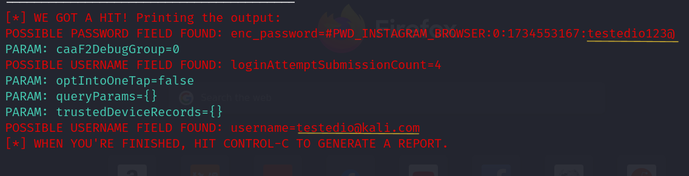

# Phishing para captura de senhas do Facebook

### Ferramentas

- Kali Linux
- Anonsurf
- setoolkit

### Configurando o Phishing no Kali Linux

- Iniciando aplicativo de anonimato: ``` sudo anonsurf start ```
- Iniciando o setoolkit: ``` sudo setoolkit ```
- Tipo de ataque: ``` 1) Social-Engineering Attacks ```
- Vetor de ataque: ``` 2) Web Site Attack Vectors ```
- Método de ataque: ``` 3) Credential Harvester Attack Method ```
- Método de ataque: ``` 2) Site Cloner ```
- O aplicativo irá sugerir o próprio endereço da maquina: ``` Nesse caso basta teclar enter ```
- URL para clone: http://www.facebook.com

### Resutados


